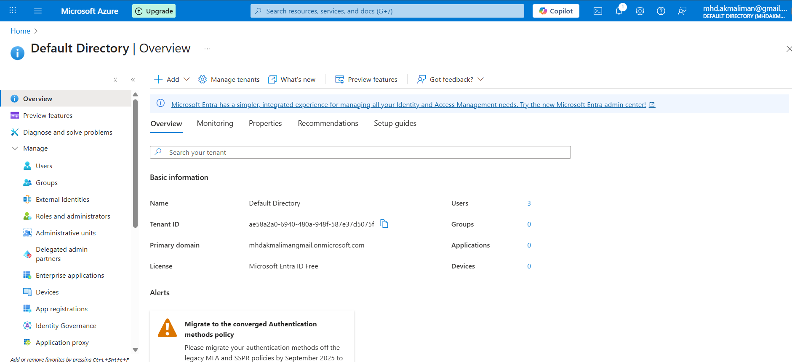
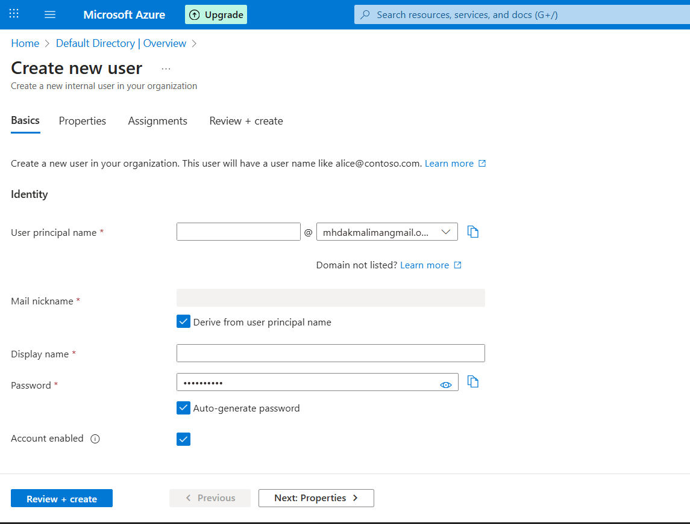
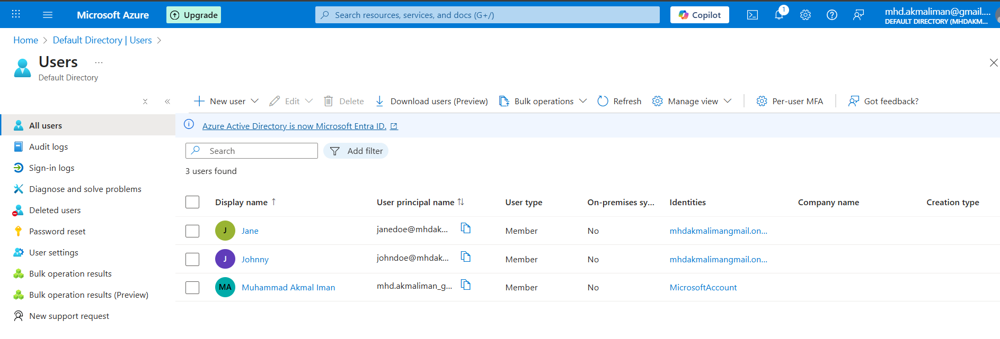
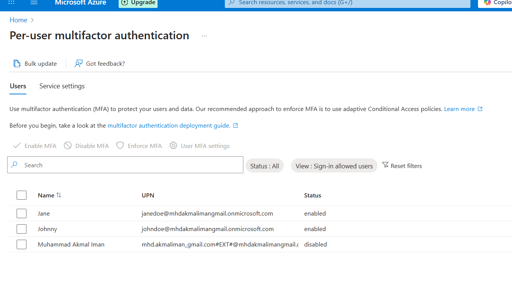
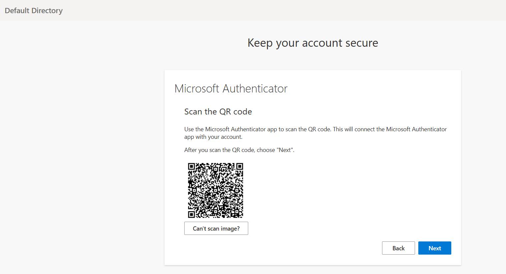
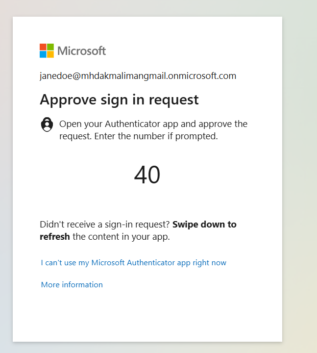
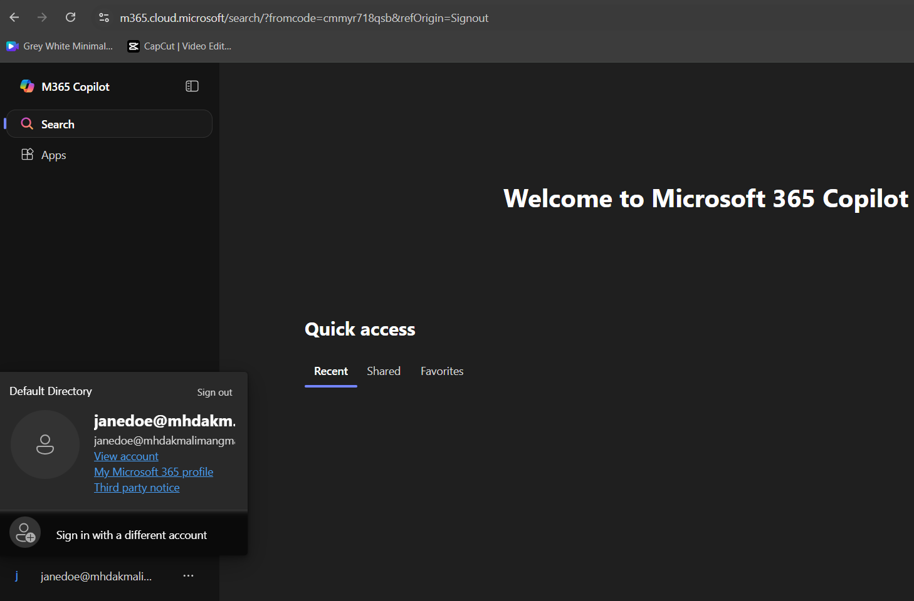

# 🔑 Azure AD – User Management & MFA Lab

## 📌 Project Overview
Configured **Microsoft Entra ID (Azure AD)** cloud users and enforced **Multi-Factor Authentication (MFA)** to improve account security.  
This lab demonstrates a core helpdesk workflow: provisioning users and protecting sign-ins.

---

## 🎯 Objectives
- Create a cloud user in Microsoft Entra ID
- Enable and enforce Multi-Factor Authentication
- Validate MFA registration and login success

---

## 🛠️ Tools & Skills Used
- **Azure Portal** (Microsoft Entra ID)
- **Microsoft Authenticator** mobile app
- Skills: Identity Management · Account Provisioning · MFA Security · Documentation

---

## 📸 Steps & Implementation

### 1) Directory Overview
Viewed **Microsoft Entra ID** tenant details.  

---

### 2) Create a New User
Created a new cloud-only user with a temporary password.  

---

### 3) Verify User
Confirmed the new user appears in **Users list**.  

---

### 4) Enable MFA
Enabled MFA for the user under **Security → MFA → Per-User MFA**.  

---

### 5) MFA Registration Prompt
Logged in as the test user at **portal.office.com** and was prompted to configure **Authenticator App**.  

---

### 6) MFA Verification & Successful Login
Entered verification code, completed login, and accessed the Microsoft 365 dashboard.  
  

---

## ✅ Results
- Cloud user successfully created in Microsoft Entra ID
- MFA enforced and verified during sign-in
- Demonstrated key **identity & access management** workflow

---

## 🚀 Key Takeaways
- Comfortable provisioning users in **Azure AD / Microsoft Entra ID**
- Practical experience enabling and testing **MFA**
- Improved understanding of **cloud identity security**
