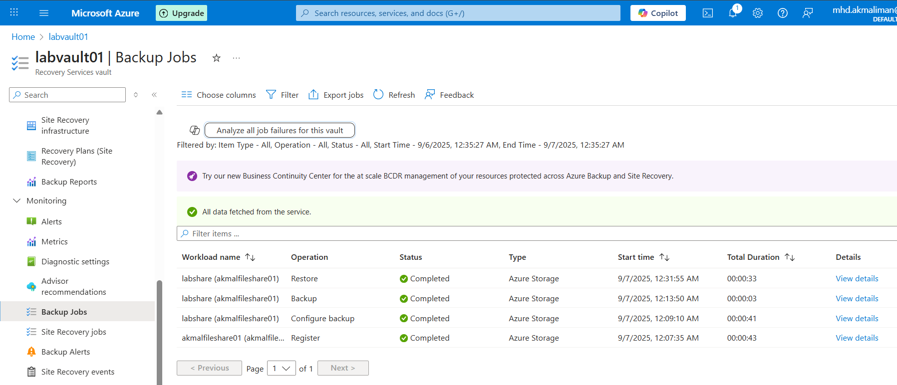

# 🔄 Azure File Share – Backup & Recovery Lab

## 📌 Project Overview
Protected an existing **Azure File Share** by enabling backup in a **Recovery Services Vault**, triggered an on-demand backup, and restored a deleted file.  
This demonstrates cloud-based data protection and recovery skills.

---

## 🎯 Objectives
- Create a Recovery Services Vault
- Enable backup for an Azure File Share
- Run an on-demand backup
- Restore a deleted file

---

## 🛠️ Tools & Skills Used
- **Azure Portal**
- **Recovery Services Vault**
- **Azure File Share**
- Skills: Backup & Recovery · Disaster Recovery · Cloud Administration

---

## 📸 Steps & Screenshots
1. Vault created 
2. Backup enabled for file share 
3. On-demand backup job 
4. Restore wizard 
5. File successfully restored 

---

## ✅ Results
- Recovery Services Vault deployed
- File share protected with scheduled and on-demand backups
- Verified point-in-time restore of deleted file

---

## 🚀 Key Takeaways
- Practical experience protecting **Azure Files** with cloud backup
- Learned backup policy basics and on-demand restore
- Enhanced portfolio with **disaster recovery** skills
