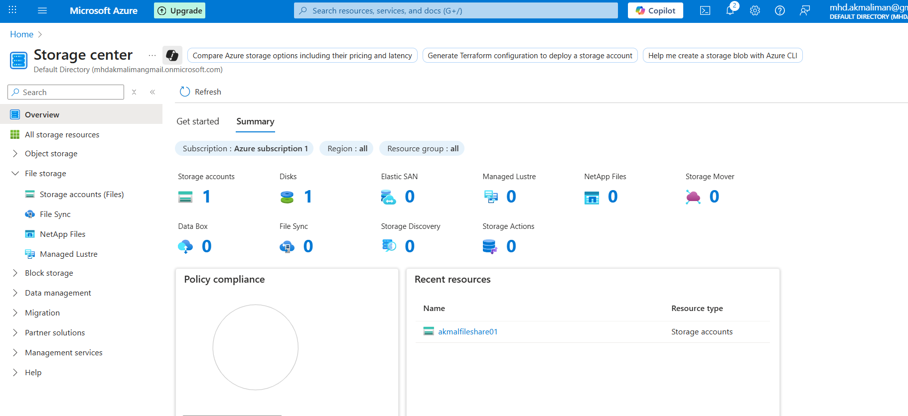
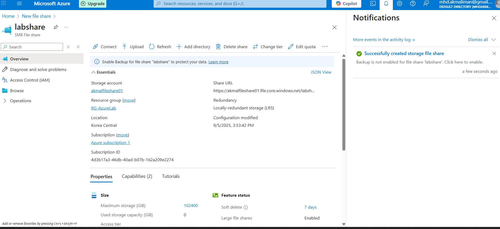
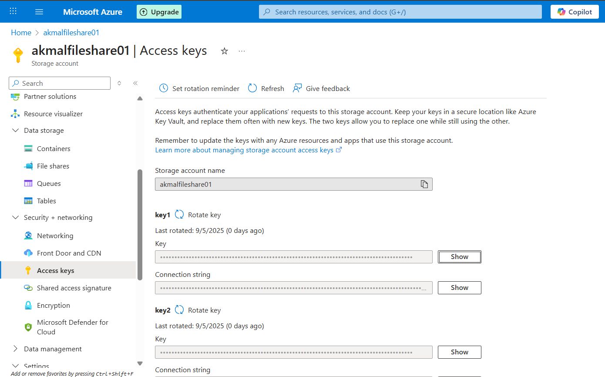
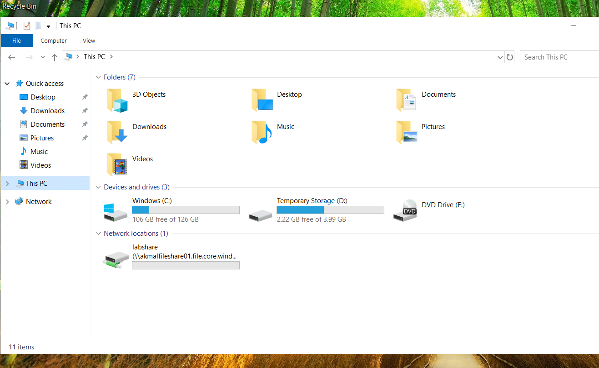
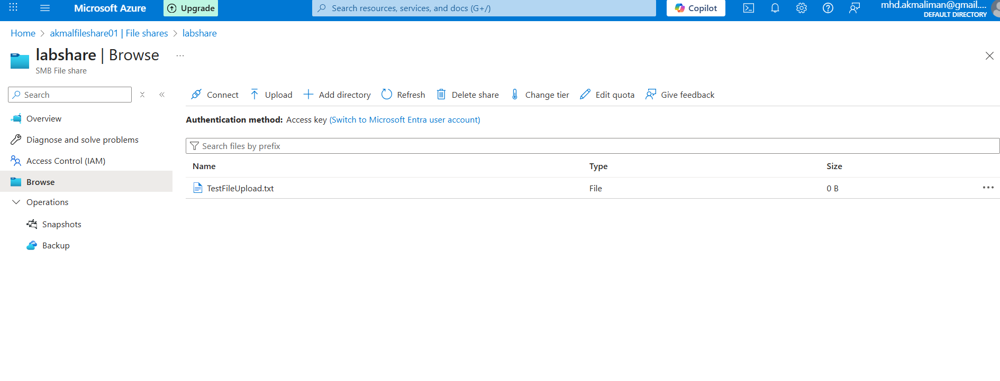

# ☁️ Azure File Share – Drive Mapping Lab

## 📌 Project Overview
This lab demonstrates how to provision an **Azure Storage File Share** and map it as a **network drive** inside a Windows VM.  
Azure Files provides SMB file shares hosted in the cloud, enabling seamless access from Windows endpoints as if they were on-prem file servers.

---

## 🎯 Objectives
- Create an **Azure Storage Account** and SMB **File Share**
- Retrieve **Access Keys** for secure authentication
- Map the share as a **network drive** in a Windows VM
- Verify read/write access by uploading a test file

---

## 🛠️ Tools & Skills Used
- **Azure Portal**
- **Azure Storage (File Shares)**
- **Windows 10 Virtual Machine (in Azure)**
- Skills: Cloud File Services · SMB Access · Basic Storage Administration

---

## 📸 Steps & Screenshots

### 1) Create a Storage Account
- Azure Portal → **Storage accounts → + Create**
- Selected **Standard**, **LRS**, **StorageV2 (general purpose v2)**
- Deployed in the same region as the VM  

---

### 2) Create a File Share
- Storage account → **File shares → + File share**
- Named the share `labshare`  

---

### 3) Retrieve Access Keys
- Storage account → **Security + networking → Access keys**
- Copied **Account name** & **Key1** for SMB credentials  

---

### 4) Map Network Drive in Windows VM
- Inside the Azure Windows VM:
  - File Explorer → **This PC → Map network drive**
  - **Drive letter:** `Z:`
  - **Folder:** `\\<storageaccount>.file.core.windows.net\<sharename>`
  - **Username:** `Azure\<storageaccount>`
  - **Password:** Key1 value
- Connection succeeded, share mounted as `Z:`  

---

### 5) Verify File Operations
- Copied a sample text file into `Z:\`
- File visible in Azure Portal under the same file share  

---

## ✅ Results
- Azure Storage account & SMB file share deployed
- Successfully mapped as a network drive inside Windows VM
- Verified full read/write capability

---

## 🚀 Key Takeaways
- Learned how to integrate **Azure Storage** with a Windows endpoint using SMB
- Understood the role of **Access Keys** in authenticating to Azure Files
- Portfolio-ready lab showing **cloud-to-endpoint** connectivity

