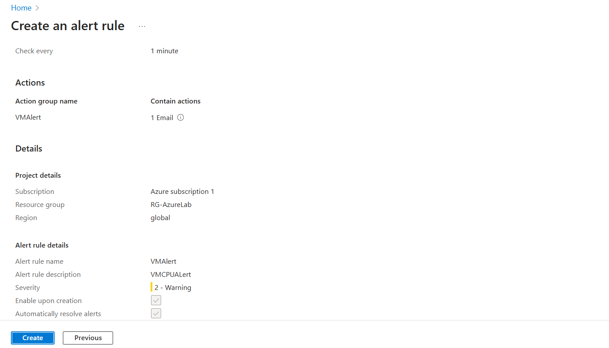
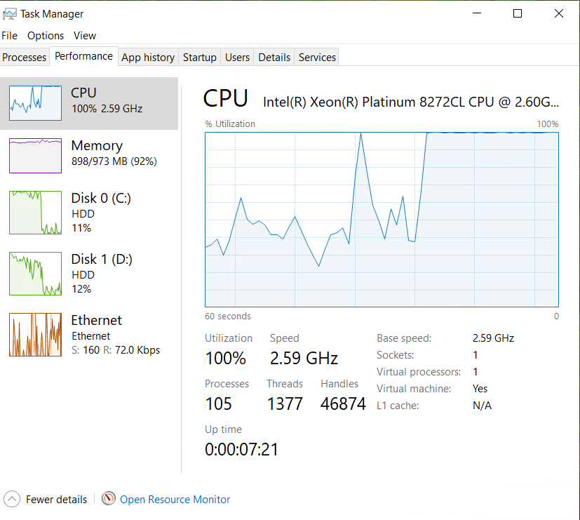
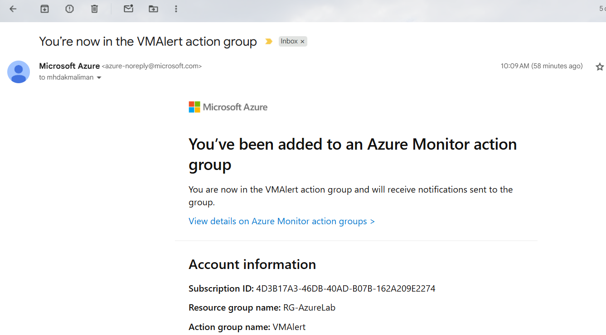
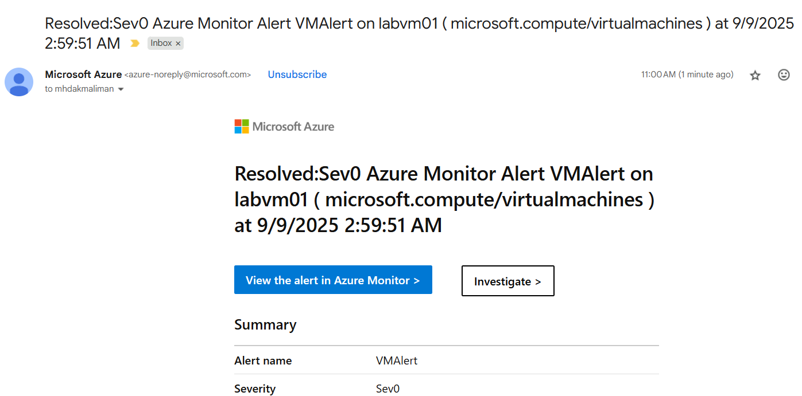

# 📊 Azure Monitor Alert – VM CPU Usage

## 📌 Project Overview
This lab demonstrates how to configure and test an **Azure Monitor Alert Rule** for monitoring **VM CPU utilization**.  
The alert notifies administrators via **email** when CPU usage exceeds a defined threshold.  

---

## 🎯 Objectives
- Create an **Action Group** with email notification  
- Configure a **CPU Alert Rule** for a VM  
- Trigger the alert by stressing the VM CPU  
- Verify email notification received  

---

## 🛠️ Tools & Skills Used
- **Azure Monitor**  
- **Virtual Machines (VM)**  
- **Action Groups**  
- Skills: Monitoring · Alerting · Troubleshooting · Documentation  

---

## 📸 Steps & Screenshots

### 1) Configure Alert Rule
- In **Azure Monitor → Alerts → Alert rules → + Create**  
- Target: `labvm01` (VM)  
- Signal: **Percentage CPU**  
- Aggregation: **Average**  
- Operator: **Greater than**  
- Threshold: **80%**  
- Frequency: Every 1 minute  
- Lookback: 1 minute  
  

---

### 2) Trigger CPU Spike
- Logged into the VM and ran apps/stress test until CPU reached ~100%  
- Verified high CPU usage in Metrics Explorer  
  

---

### 3) Email Notifications
- Received **Action Group email confirmation** when added  
  

- Received **Alert email** when CPU exceeded 80%  
  

---

## ✅ Results
- Successfully created and tested a VM CPU alert in Azure Monitor  
- Verified **Action Group email** and **alert trigger email**  
- Alert fired within ~2 minutes of CPU spike  

---

## 🚀 Key Takeaways
- Practiced configuring **real-time alerts** in Azure Monitor  
- Learned how Action Groups deliver notifications  
- Reinforced skills in **monitoring, alerting, and troubleshooting**  

---