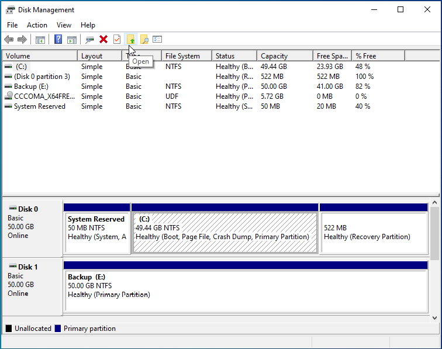

# 💻 IT Support Portfolio – Muhammad Akmal Iman

Welcome to my **IT Support Portfolio**!  
This repository showcases my hands-on IT support labs, troubleshooting projects, and system administration case studies using **Windows 10 Pro, Windows Server, and IT support tools**.  

My goal is to demonstrate **practical IT support and system administration skills** through real-world scenarios such as Active Directory management, disk optimization, and troubleshooting.  

---

## 📂 Projects

| Project | Description |
|---------|-------------|
| [Windows 10 – Disk Management & Partitioning](./windows10-disk-management) | Created and managed a VHD, performed partitioning, formatting, shrinking/extending volumes, and optimized system performance. |
| [Windows 10 – Domain Join to Active Directory](./active_directory) | Configured Windows 10 Pro to join a domain managed by Windows Server. |
| [Windows 10 – Security Hardening](./windows10-security-hardening) | Enabled BitLocker encryption, configured Windows Defender Antivirus, and applied firewall rules to strengthen endpoint security. |
| [Windows 10 – Local Group Policy Hardening](./windows10-localgpo-lab) | Enforced password length, account lockout, and audit policies on a standalone VM; verified with `net accounts`, `auditpol`
| [Windows Backup and Restore](./Windows-Backup-and-Restore) | Demonstrated backup/restore operations using system images and file-level backups. |
| [Fix Corrupt User Profile Case Study](./fix-corrupt-user-profile-case-study) | Diagnosed and repaired a corrupted user profile in Windows 10. |
| [MySQL Helpdesk Ticket System (CMD Case Study)](./MySQL-ticket-case-study) | Built a simple ticket database in MySQL via Command Prompt, performed CRUD operations, and simulated helpdesk workflows. |
| [Networking Essentials](./networking) | Performed diagnostics with `ping`, `tracert`, and DNS troubleshooting. |
| [Remote Software Installation](./remote-software-installation) | Installed software remotely using TeamViewer. |
| [Troubleshooting Scenarios](./troubleshooting) | Documented real-world troubleshooting steps for common Windows issues. |
| [Google Sheets Ticketing System](./IT-Helpdesk-Ticketing-System) | Created a no-code IT support ticketing system using Google Forms for ticket submission and Google Sheets for ticket management. |
| [Azure AD – User Management & MFA Lab](./Azure-ad-mfa-lab) | Created a cloud user in Microsoft Entra ID, enforced MFA, and validated login security. |
| [Azure File Share – Drive Mapping Lab](./Azure-file-share-lab) | Created an Azure Storage File Share and mapped it as a network drive in a Windows VM, verifying read/write access. |
| [Azure File Share – Backup & Recovery Lab](./Azure-file-share-backup-lab) | Enabled a Recovery Services Vault, protected an Azure File Share, triggered an on-demand backup, and restored a deleted file. |
| [Azure Monitor – VM CPU Alert Lab](./Azure-monitor-cpu-lab) | Configured and tested Azure Monitor alert rule with email notification when VM CPU usage exceeded 80%. |
| [Linux - User Onboarding Case study](./linux-user-onboarding-case-study) | A case study demonstrating fundamental Linux user and group management through a real-world account provisioning scenario. |
| [Linux - System Maintenance & Health Check](./linux-system-maintenance-and-health-check) | A case study in proactive system maintenance, demonstrating skills in resource monitoring, log analysis, and system cleanup. |

---

## 📜 Certifications
- ✅ [Google IT Support Professional Certificate](https://www.coursera.org/account/accomplishments/specialization/22NWF3P73SVQ)  
- 📖 [Microsoft 365 Fundamentals (MS-900)](https://drive.google.com/file/d/1CABs4ltWfIXagNygahDzQ4dSw3_wwebB/view?usp=sharing) 

---

## ⚙️ Skills Demonstrated
 
  
  
  
 
  
  

- Windows 10/11 troubleshooting & administration
- Linux CLI & Administration  
- Active Directory
- Disk management, partitioning & optimization  
- Networking basics (DNS, DHCP, TCP/IP troubleshooting)  
- PowerShell scripting for automation  
- Documentation & technical communication
- Endpoint security hardening (BitLocker, Windows Defender, Firewall rules)

---

## 📸 Example Screenshot
*(from Disk Management & Partitioning project)*  

  

---

## 👨‍💻 About Me
I am an **IT graduate** with practical experience in setting up and troubleshooting Windows environments.  
I enjoy solving technical problems, documenting solutions, and continuously learning to improve IT support delivery.  

- 🌍 Based in Kedah, Malaysia (open to opportunities across Malaysia)  
- 🔗 [LinkedIn](https://linkedin.com/in/akmaliman)  
- 📂 [GitHub Portfolio](https://github.com/Akmal1285/it-support-portfolio-akmaliman)  

---

## 🚀 Next Steps
This portfolio is continuously growing. Upcoming projects include:  
- **Remote Troubleshooting Lab** (RDP, PowerShell Remoting)  
- **Networking Diagnostics** (ping, tracert, DNS resolution labs)  
- **Automation Projects** (bulk user creation, scheduled backups with PowerShell)  

Stay tuned!
