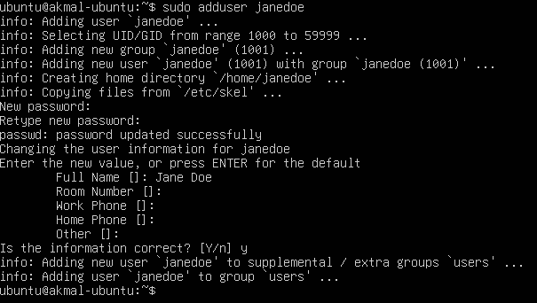
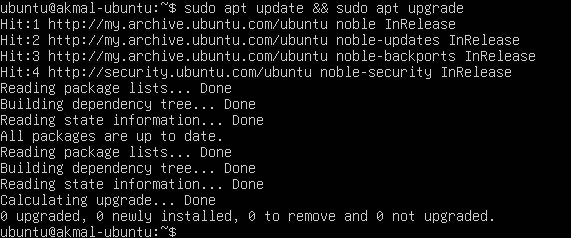

# IT Support: Linux User Onboarding Case Study

### 📘 Overview

This project demonstrates the process of **onboarding a new employee** by creating a user account and managing group permissions on a Linux server. The scenario simulates a real-world IT support ticket for account provisioning. The goal is to securely and efficiently create a new user and grant them the correct level of access.

The system allows me to **practice fundamental system administration skills** and **document the entire process** from a command-line interface.

### 🔧 Features

* **User Account Creation:** Securely create a new user account with a password.
* **Group Management:** Add a user to a specific group to grant them administrative privileges.
* **Permission Control:** Understand the importance of using `sudo` to run commands with elevated rights.
* **Verification:** Confirm that user and group changes were applied correctly.

### ⚙️ Tools Used:

* **Ubuntu Server:** The Linux distribution used for the server environment.
* **VirtualBox:** The virtualization software used to host the Linux server.
* **Linux Command Line (CLI):** The primary interface for all commands and configurations.

### 🛠️ Setup Instructions

1.  A new virtual machine was created in **VirtualBox** using an **Ubuntu Server LTS** ISO image.
2.  During the installation, a **non-root user** was created with `sudo` privileges.
3.  The base operating system was installed without any additional "snaps" to ensure a clean environment.

###  Workflow

A new employee, Jane Doe, requires a user account with administrative privileges. I performed the following steps in the command line:

1.  **Created a new user account** for Jane.

    ```bash
    sudo adduser janedoe
    ```
    

2.  **Added Jane's account to the `sudo` group**, granting her administrative privileges.

    ```bash
    sudo usermod -aG sudo janedoe
    ```
    
3.  **Verified the group membership** to ensure the command was successful.

    ```bash
    groups janedoe
    ```
    
    
    The output confirmed that her account was now in the `sudo` group.

4.  **Completed system updates** to ensure the server was secure before use.

    ```bash
    sudo apt update && sudo apt upgrade
    ```
    

### 💡 Key Learnings

* **Gained proficiency in fundamental Linux commands** for user and group management.
* **Understood the security principles** behind creating non-root users and using `sudo`.
* **Practiced a core IT support task** (account provisioning) in a simulated environment.
* **Demonstrated problem-solving skills** by troubleshooting a common login issue during the initial setup.


