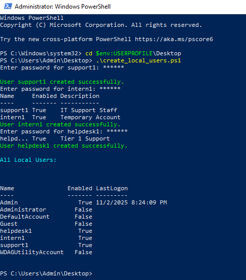
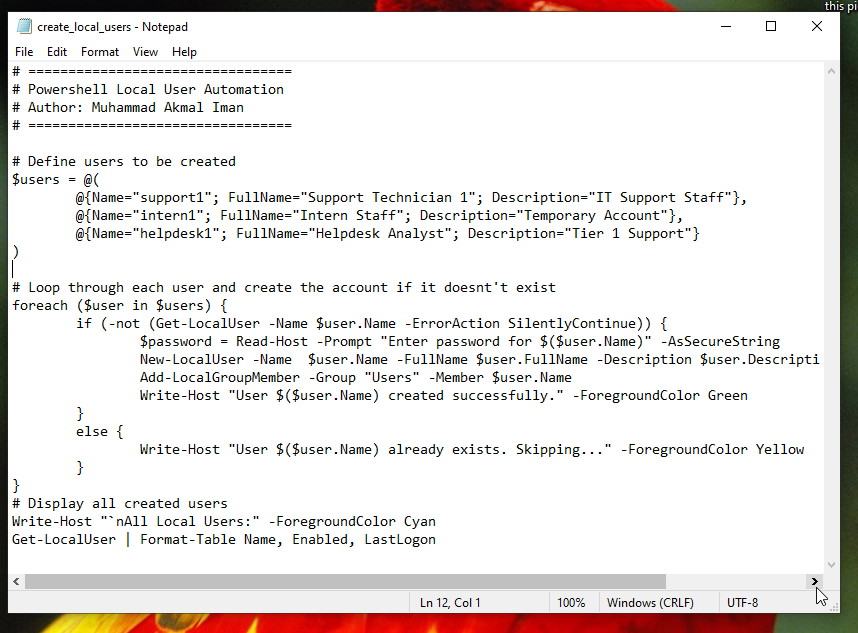
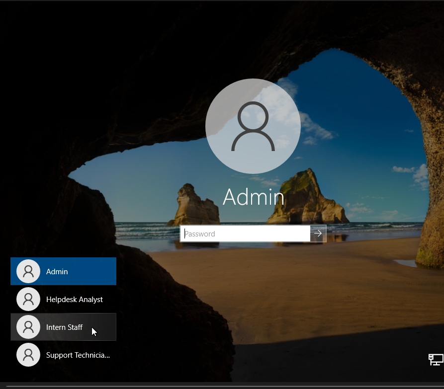

### ⚙️ Windows 10 – PowerShell Local User Automation
Automated local user account creation using PowerShell scripting.

**Key Skills:** PowerShell · Automation · User Management

**Overview:**
This script automates the creation of multiple local user accounts on Windows 10. It prompts for passwords, assigns groups, and verifies the results — simulating how IT Support staff automate onboarding tasks.

**Commands Used:**
- `New-LocalUser`
- `Add-LocalGroupMember`
- `Get-LocalUser`

**Outcome:**
Efficient, repeatable user creation process for endpoint setup.

Powershell console

Script in notepad

Login screen

