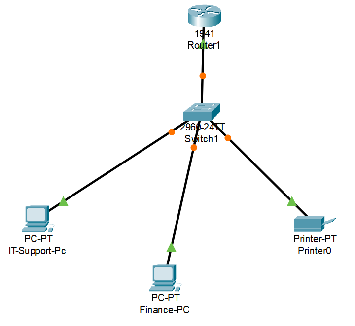
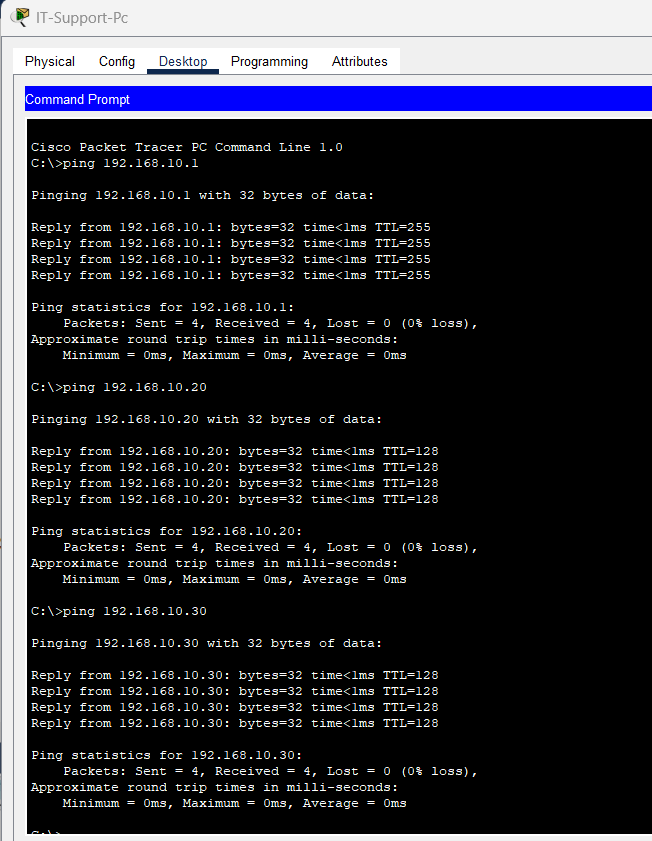
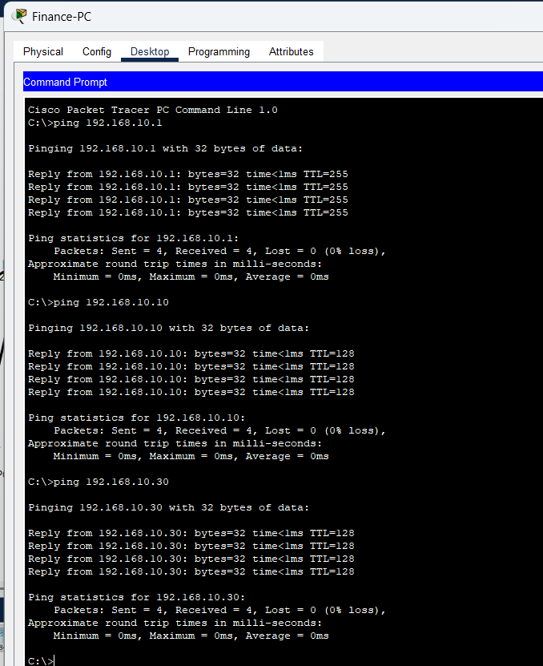

# Small Office Network Setup

## Project Overview
This project demonstrates a basic office network setup using Cisco Packet Tracer. It highlights my ability to:

- Configure LAN devices (Router, Switch, PCs, Printer)
- Assign static IP addresses
- Test connectivity between devices
- Troubleshoot common network issues

This simulates a realistic small office environment, showcasing IT Support skills relevant for helpdesk and infrastructure roles.

---

## Network Topology

**Devices Used:**

- 1 x Cisco Router 1941
- 1 x Cisco Switch 2960
- 2 x PCs
- 1 x Network Printer

---

## IP Address Configuration

| Device        | IP Address     | Subnet Mask     | Default Gateway |
|---------------|---------------|----------------|----------------|
| `Router`      | 192.168.10.1  | 255.255.255.0  | —              |
| `ITSupport-PC`| 192.168.10.10 | 255.255.255.0  | 192.168.10.1   |
| `Finance-PC`  | 192.168.10.20 | 255.255.255.0  | 192.168.10.1   |
| `Printer`     | 192.168.10.30 | 255.255.255.0  | 192.168.10.1   |
---

## Connectivity Testing

All devices were tested to ensure proper network connectivity. The following ping tests were performed:

- `ITSupport-PC` → Router
- `ITSupport-PC` → `Finance-PC`
- `ITSupport-PC` → Printer
- `Finance-PC` → Router
- `Finance-PC` → `ITSupport-PC`
- `Finance-PC` → Printer

All devices successfully replied, confirming correct network setup.

---

## Troubleshooting Examples

Simulated network issues were introduced to demonstrate IT support skills. Detailed steps are documented in [`troubleshooting_log.txt`](troubleshooting_log.txt).

**Examples include:**

- Incorrect IP address on a PC (`Finance-PC`)
- Disconnected network cable (`ITSupport-PC`)
- Router interface shutdown

**Snapshots for each issue:**

- `snapshot_issue1.png` → `Finance-PC` wrong IP
- `snapshot_issue2.png` → `ITSupport-PC` disconnected cable
- `snapshot_issue3.png` → Router interface down

---

## How to Use
1. Open `topology.pkt` in Cisco Packet Tracer.
2. Observe the network topology and device configurations.
3. Use Command Prompt on PCs to test connectivity (`ping`).
4. Optionally, simulate issues to practice troubleshooting using the snapshots and `troubleshooting_log.txt`.

---

## Skills Demonstrated
- LAN configuration and IP addressing
- Basic Cisco CLI commands
- Network troubleshooting methodology
- Documentation of IT support procedures
