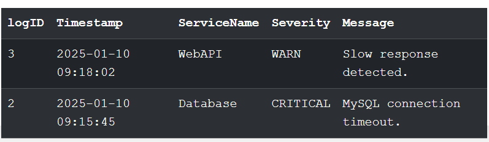
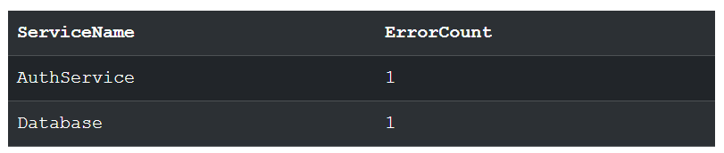
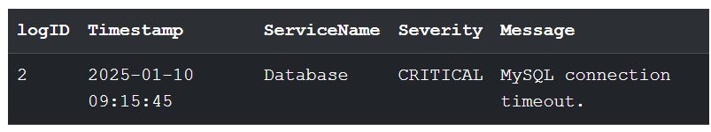
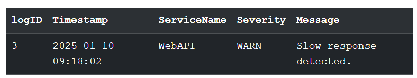
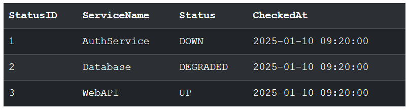
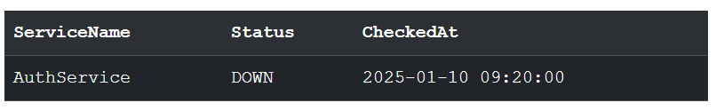

# 📊 System Monitoring & Error Log Database (SQL Project)

## 📌 Project Overview
This project simulates a System Monitoring Database used by IT Support, NOC, and Application Support Engineers.  
It demonstrates how SQL is used to investigate failures, monitor service health, analyze outages, and track admin actions.

All SQL queries were executed in SQL Fiddle (MySQL).

---

## 🎯 Objectives
- Practice a structured troubleshooting workflow (identify → test → resolve → verify)  
- Create a realistic monitoring-style SQL dataset  
- Perform practical SQL log analysis  
- Demonstrate IT Support & Application Support investigation skills  
- Strengthen SQL proficiency for real technical support tasks  

---

## 🛠️ Tools & Skills Used
- SQL Fiddle (MySQL)  
- SQL (SELECT, WHERE, LIKE, GROUP BY, ORDER BY)  
- Log analysis  
- Troubleshooting  
- Documentation  

---

## 🏗️ Database Schema

### **1. SystemLogs**
Stores application/system events and errors.

| Column      | Type                                  | Description                    |
|-------------|----------------------------------------|--------------------------------|
| LogID       | INT (PK) AUTO_INCREMENT                | Unique ID for each log         |
| Timestamp   | DATETIME                               | When the event happened        |
| ServiceName | VARCHAR(50)                            | Service that generated the log |
| Severity    | ENUM('INFO','WARN','ERROR','CRITICAL') | Severity level                 |
| Message     | TEXT                                   | Log message                    |

---

### **2. ServiceStatus**
Tracks current health of services.

| Column      | Type                           | Description          |
|-------------|--------------------------------|----------------------|
| StatusID    | INT (PK) AUTO_INCREMENT        | Unique ID            |
| ServiceName | VARCHAR(50)                    | Service name         |
| Status      | ENUM('UP','DOWN','DEGRADED')   | Health state         |
| CheckedAt   | DATETIME                       | Monitoring time      |

---

### **3. AuditLog**
Tracks administrative actions.

| Column    | Type         | Description               |
|-----------|--------------|---------------------------|
| AuditID   | INT (PK)     | Unique ID                 |
| Username  | VARCHAR(50)  | Who performed the action  |
| Action    | VARCHAR(100) | What action was taken     |
| Timestamp | DATETIME     | When it happened          |

---

## 📥 SQL Script (Initialization + Sample Logs)

```sql
CREATE TABLE SystemLogs (
  LogID INT AUTO_INCREMENT PRIMARY KEY,
  Timestamp DATETIME,
  ServiceName VARCHAR(50),
  Severity ENUM('INFO','WARN','ERROR','CRITICAL'),
  Message TEXT
);

CREATE TABLE ServiceStatus (
  StatusID INT AUTO_INCREMENT PRIMARY KEY,
  ServiceName VARCHAR(50),
  Status ENUM('UP','DOWN','DEGRADED'),
  CheckedAt DATETIME
);

CREATE TABLE AuditLog (
  AuditID INT AUTO_INCREMENT PRIMARY KEY,
  Username VARCHAR(50),
  Action VARCHAR(100),
  Timestamp DATETIME
);

INSERT INTO SystemLogs (Timestamp, ServiceName, Severity, Message) VALUES 
('2025-01-10 09:15:21','AuthService','ERROR','Failed to validate token.'),
('2025-01-10 09:15:45','Database','CRITICAL','MySQL connection timeout.'),
('2025-01-10 09:18:02','WebAPI','WARN','Slow response detected.');

INSERT INTO ServiceStatus (ServiceName, Status, CheckedAt) VALUES 
('AuthService','DOWN','2025-01-10 09:20:00'),
('Database','DEGRADED','2025-01-10 09:20:00'),
('WebAPI','UP','2025-01-10 09:20:00');

INSERT INTO AuditLog (Username, Action, Timestamp) VALUES 
('admin','Restarted Database Server','2025-01-10 09:22:00'),
('system','HealthCheck executed','2025-01-10 09:23:00'),
('admin','Restarted AuthService','2025-01-10 09:25:00');


### 🔍 Investigative SQL Queries

1. **Show recent WARN or CRITICAL logs**  
---sql
	SELECT * FROM SystemLogs
	WHERE Severity IN ('WARN','CRITICAL')
	ORDER BY Timestamp DESC
	LIMIT 10;
----

  

2. **Count errors per service**
```sql
	SELECT ServiceName, COUNT(*) AS ErrorCount
	FROM SystemLogs
	WHERE Severity IN ('ERROR','CRITICAL')
	GROUP BY ServiceName
	ORDER BY ErrorCount DESC;
```


   
3. **List all CRITICAL failures**
```sql
	SELECT * FROM SystemLogs
	WHERE Severity = 'CRITICAL';
```


  
4. **Find performance issues**
```sql
	SELECT * FROM SystemLogs
	WHERE Message LIKE '%slow%' OR Message LIKE '%response%';
```

   
5. **Show overall service health**  
 ```sql
	SELECT * FROM ServiceStatus;
```


6. **Identify services that are DOWN**
```sql
	SELECT ServiceName, Status, CheckedAt
	FROM ServiceStatus
	WHERE Status = 'DOWN';
```


### ✅ Outcome
By completing this SQL project, I practiced:

-Error log analysis

-System health monitoring

-Root-cause investigation

-SQL filtering, grouping, and sorting

-Query optimization thinking

-Simulating real monitoring duties in IT Support / Application Support

-This project demonstrates practical SQL skills directly used in support roles.

---


### 📐 ERD 

+------------------+        +------------------+
|   ServiceStatus  |        |    SystemLogs    |
+------------------+        +------------------+
| StatusID (PK)    |        | LogID (PK)       |
| ServiceName      |<-------| ServiceName      |
| Status           |        | Severity         |
| CheckedAt        |        | Timestamp        |
+------------------+        | Message          |
                            +------------------+

                +------------------+
                |    AuditLog      |
                +------------------+
                | AuditID (PK)     |
                | Username         |
                | Action           |
                | Timestamp        |
                +------------------+


