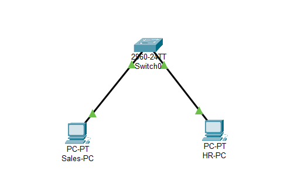

# Project: Layer 2 Network Segmentation (VLANs)

## 📌 Project Overview
This project demonstrates the implementation of **Virtual Local Area Networks (VLANs)** to logically isolate department traffic on a single Cisco 2960 Switch. The goal was to move from a flat network to a segmented architecture, ensuring that the **Sales** department and **HR** department cannot communicate at Layer 2 for enhanced security.

## 🛠️ Network Topology

**

## 🚀 Implementation Steps

### 1. Initial Connectivity (Baseline)
Before configuration, both PCs were placed in the default VLAN (VLAN 1).
* **Sales-PC:** `192.168.1.1`
* **HR-PC:** `192.168.1.2`
* **Test:** Initial `ping` was **Successful**, proving that all ports can communicate by default.

### 2. VLAN Configuration
I created two distinct VLANs to act as security boundaries:
```bash
Switch(config)# vlan 10
Switch(config-vlan)# name Sales
Switch(config)# vlan 20
Switch(config-vlan)# name HR
```
### 3. Port Assignment
I manually assigned the physical switch ports to their respective logical VLANs:
Interface Fa0/1 -> VLAN 10 (Sales)
Interface Fa0/2 -> VLAN 20 (HR)
```bash
Switch(config)# interface fa0/1
Switch(config-if)# switchport access vlan 10
Switch(config)# interface fa0/2
Switch(config-if)# switchport access vlan 20
```

## ✅ Verification & Results
VLAN Database Check
I verified the assignments using the show vlan brief command to ensure the ports were correctly mapped.

**Connectivity Isolation Test
I attempted a ping from Sales-PC to HR-PC to confirm that the segmentation was working.

**Result: Request Timed Out.
* Conclusion: The isolation is successful. The switch now prevents cross-department communication, effectively securing the network.

## 💡 Skills Demonstrated
Cisco IOS CLI: Navigation and configuration.
Network Administration: Creating and managing VLANs.
Security Implementation: Applying the principle of least privilege at the Network Layer.
