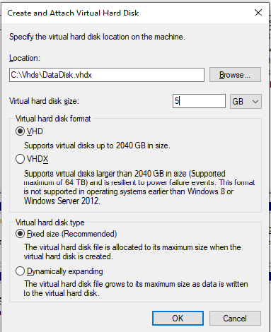
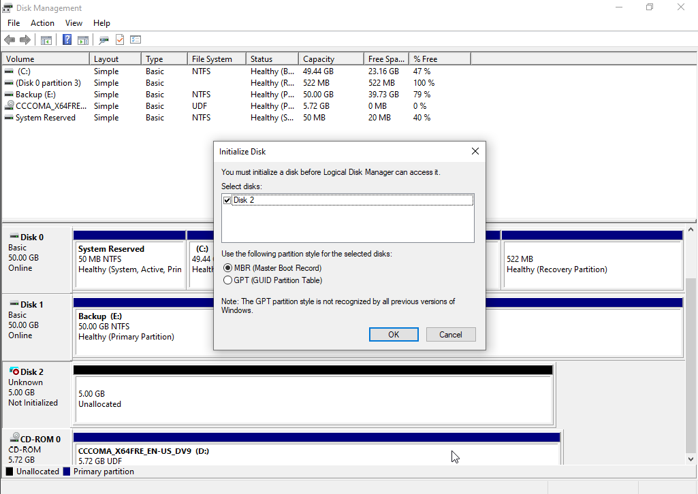
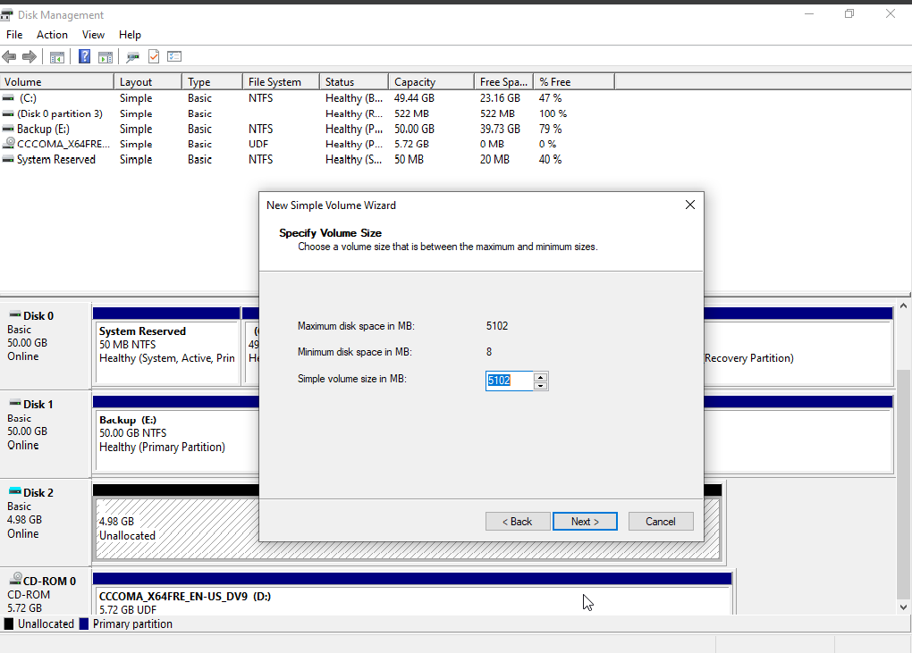
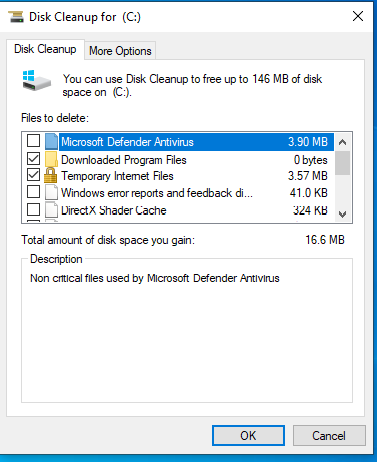
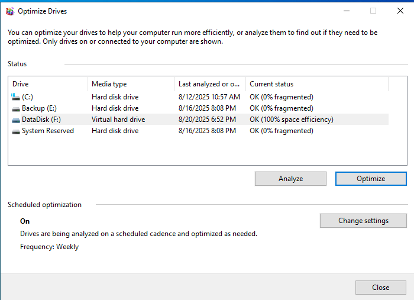

# 🖥️ Windows 10 Pro – Disk Management & Partitioning

## 📌 Project Overview
This project demonstrates how to manage disks, create virtual hard drives, partition, format, and optimize storage in **Windows 10 Pro**.  

Disk management is an essential IT Support skill used for:
- Troubleshooting low disk space  
- Configuring new drives  
- Maintaining system performance  

---

## 🎯 Objectives
- Create and attach a **Virtual Hard Disk (VHD)**
- Partition and format the new drive
- Perform volume operations (extend, shrink, change drive letter)
- Run **Disk Cleanup** to free storage
- Optimize drives for better performance  

---

## 🛠️ Tools & Skills Used
- **Windows 10 Pro Virtual Machine**  
- **Disk Management Console (`diskmgmt.msc`)**  
- **Disk Cleanup & Optimize Drives utilities**  
- **NTFS File System & Partitioning concepts**  
- Skills: Troubleshooting, Storage Management, Documentation  

---

## 📸 Steps & Implementation

### 1. Open Disk Management
- Used **Win + X → Disk Management**  
- Viewed existing drives and partitions  

---

### 2. Create a Virtual Hard Disk (VHD)
- Created a **5 GB VHDX** file at `C:\VHDs\DataDisk.vhdx`  

---

### 3. Initialize the Disk
- Initialized the new disk using **GPT partition style**  

---

### 4. Create and Format Partition
- Created a **New Simple Volume**  
- Assigned drive letter **F:**  
- Formatted with **NTFS** and named it `DataDisk`  

---

### 5. Perform Volume Operations
- **Shrink Volume** → Reduced by 1 GB  
- **Extend Volume** → Added free space back  

---

### 6. Run Disk Cleanup
- Cleared **temporary files** and **Windows Update cache**  

---

### 7. Optimize Drives
- Ran **Defragment and Optimize Drives** tool on `DataDisk`  
- Improved performance and reduced fragmentation  

---

## ✅ Results
- Successfully created and managed a new virtual hard disk  
- Demonstrated disk partitioning, formatting, extending, and shrinking  
- Optimized drive performance and freed space using cleanup tools  
- Showcased **IT Support troubleshooting for low disk space scenarios**  

---

## 🚀 What I Learned
- Simulating the process of adding a new drive using VHDs  
- Partition management and NTFS formatting  
- Troubleshooting common storage-related issues in Windows 10  

---

## 📂 Deliverables
- Documentation (`Disk_Management_And_Partitioning.pdf`)  
- Screenshots (stored in `screenshots/` folder)  
- This README file as portfolio showcase  

---
