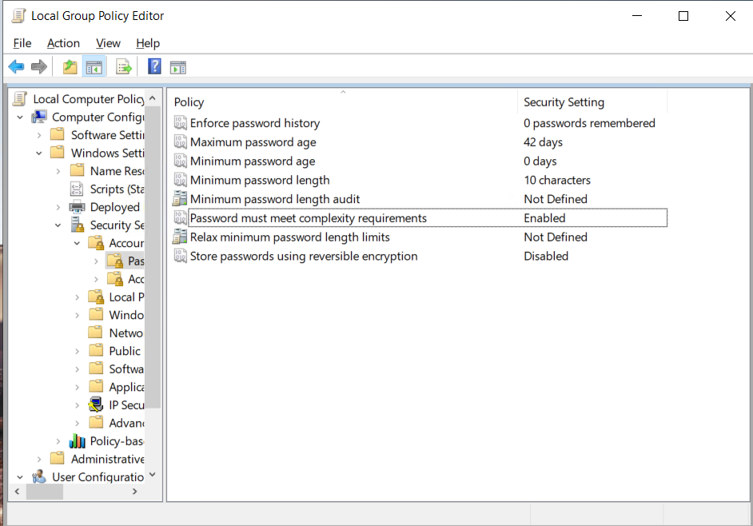
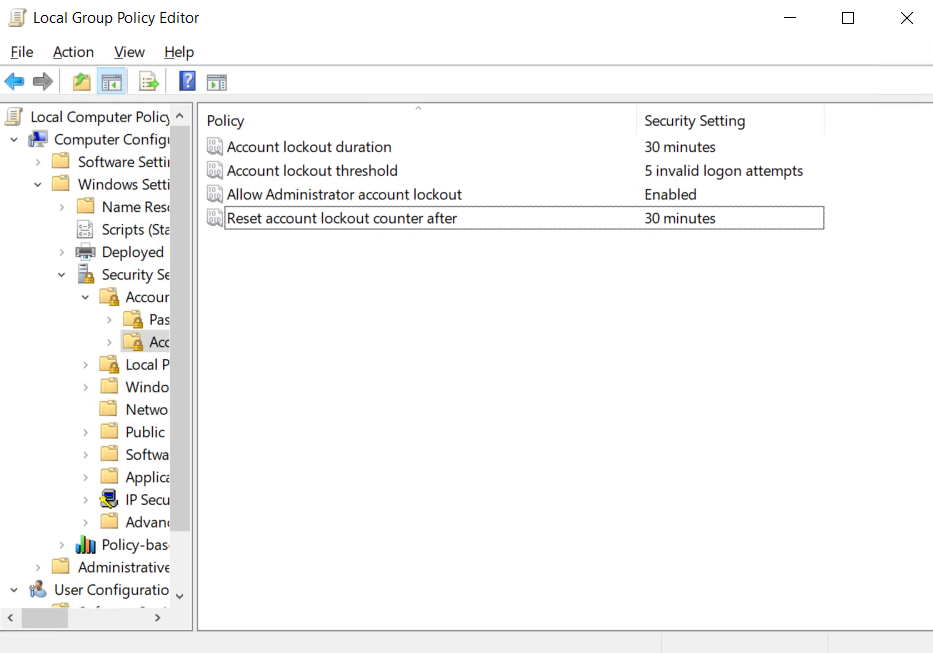
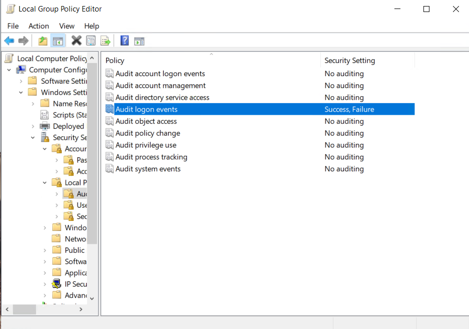
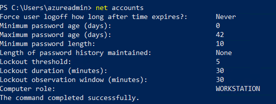
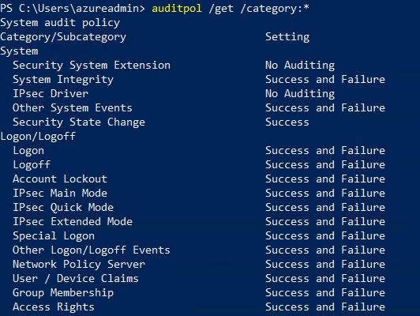

# 🔒 Windows 10 Local Group Policy Hardening Lab

This lab demonstrates how to configure and verify **Local Group Policy** settings on a standalone Windows 10 machine. It covers password policies, account lockout, and audit logging — common IT support and security administration tasks.

---

## 📌 Objectives
- Configure **password** and **account lockout** policies  
- Enable **logon auditing** (success & failure)  
- Apply changes using `gpupdate /force`  
- Verify applied settings with `net accounts`, `auditpol`, and Event Viewer  
- Document results with screenshots  

---

## 🖥️ Environment
- **OS**: Windows 10 Pro (Virtual Machine, standalone / workgroup)  
- **Tools**:
  - Local Group Policy Editor (`gpedit.msc`)
  - Command Prompt (Admin) / PowerShell (Admin)
  - Event Viewer
  - `net accounts`, `auditpol`

---

## ⚙️ Steps

### 1. Configure Password Policy
1. Run `Win + R`, type `gpedit.msc`, press Enter.  
2. Navigate to:  
   `Computer Configuration → Windows Settings → Security Settings → Account Policies → Password Policy`  
3. Configure:
   - **Minimum password length**: `10`  
   - **Password must meet complexity requirements**: `Enabled`  




---

### 2. Configure Account Lockout Policy
1. In `gpedit.msc` go to:  
   `Computer Configuration → Windows Settings → Security Settings → Account Policies → Account Lockout Policy`  
2. Set values:
   - **Account lockout threshold**: `5`  
   - **Lockout duration**: `30 minutes`  
   - **Reset account lockout counter after**: `15 minutes`  



---

### 3. Enable Logon Auditing
1. In `gpedit.msc` navigate to:  
   `Computer Configuration → Windows Settings → Security Settings → Local Policies → Audit Policy`  
2. Enable:
   - **Audit logon events**: `Success, Failure`  




---

### 4. Apply Group Policy
Run as **Administrator**:

```cmd
gpupdate /force
```

---

## ✅ Verification

### Password & Lockout Policy
Run:

```cmd
net accounts
```

Expected output:
- Minimum password length = **10**  
- Lockout threshold = **5**  
- Lockout duration = **30 minutes**  
- Lockout observation window = **15 minutes**  




---

### Audit Policy
Run:

```cmd
auditpol /get /category:*
```

Expected output:
- Logon/Logoff auditing = **Success, Failure**  


📸 `screenshots/auditpol.png`

---

## 🧾 Key Takeaways
- Local Group Policy (`gpedit.msc`) can harden security even without a domain.  
- `net accounts` and `auditpol` are the **correct verification commands** for local policies.  
- `gpresult` is primarily for domain environments — clarify this in documentation.  
- Combining **configuration screenshots** with **verification evidence** makes documentation more credible.  

---

## 🚀 Conclusion
- Configured password, lockout, and audit settings via Local Group Policy.  
- Applied policies using `gpupdate /force`.  
- Verified changes with `net accounts`, `auditpol`, and Event Viewer logs.  
- Demonstrated practical **endpoint security hardening** skills valuable for IT support roles.  

---


