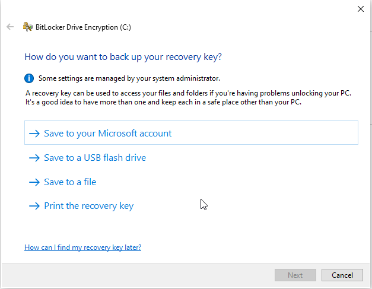
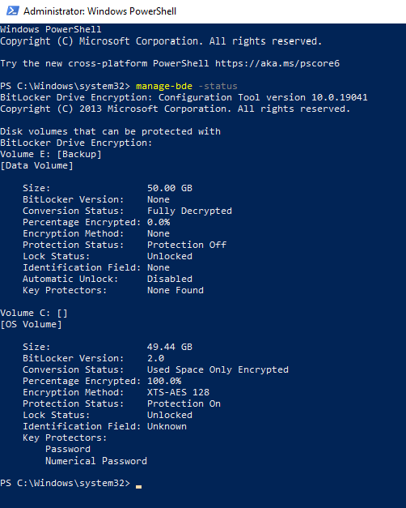
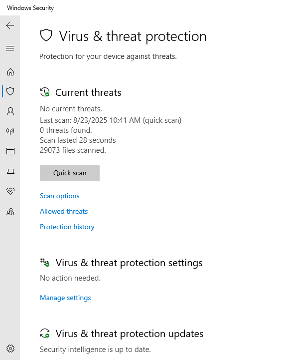
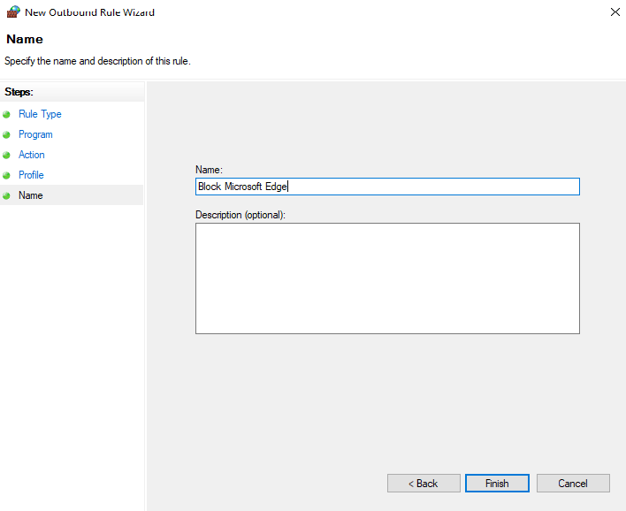
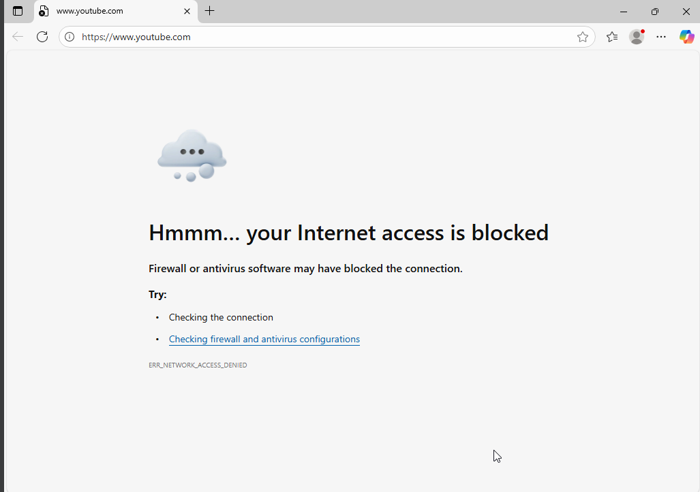

# 🔒 Windows 10 Pro – Security Hardening

## 📌 Project Overview
This project demonstrates how to harden a **Windows 10 Pro** system against common security threats using **BitLocker, Windows Defender, and Firewall rules**.  
System hardening is a core IT Support responsibility. By configuring encryption, antivirus, and firewall policies, IT professionals can protect systems from unauthorized access, malware, and network-based threats.

---

## 🎯 Objectives
- Enable and configure **BitLocker drive encryption**
- Manage and update **Windows Defender Antivirus**
- Apply Windows Firewall rules to control applications
- Test and validate the effectiveness of these security measures

---

## 🛠️ Tools & Skills Used
- **Windows 10 Pro** (Virtual Machine)
- **BitLocker Drive Encryption**
- **Windows Security (Defender Antivirus)**
- **Windows Defender Firewall with Advanced Security**
- Skills: Endpoint Security · Troubleshooting · Documentation · Access Control

---

## 📸 Steps & Implementation

### 1) Enable BitLocker Drive Encryption
- Open **Control Panel → BitLocker Drive Encryption**
- Enable BitLocker on the `C:` system drive
- Choose **password unlock** and save the **recovery key** (file/USB/print)
- Restart the system when prompted to begin encryption

---

### 2) Verify BitLocker Status
- Run the command `manage-bde -status` in **PowerShell** or **Command Prompt**
- Confirm the drive shows Percentage Encrypted and Protection Status: Protection On

---

### 3) Configure Windows Defender Antivirus
- Open **Windows Security → Virus & threat protection**
- Ensure **Real-time protection** and **Cloud-delivered protection** are **On**
- Manually Check for updates to refresh virus definitions
- Run a **Quick scan** to validate Defender is functioning

---

### 4) Create Firewall Rules
- Open **Windows Defender Firewall with Advanced Security**
- Create an **Outbound Rule** to block Microsoft Edge by **Program path**
- Apply the rule to all profiles (Domain/Private/Public)

---

### 5) Test Firewall Rules
- Launch the blocked application (Edge) → verify it cannot connect
- Capture the error as proof of enforcement

---

## ✅ Results
- **BitLocker** enabled and verified on the system drive
- **Windows Defender** configured with real-time & cloud-delivered protection, definitions updated
- **Outbound firewall rule** applied and tested (Edge blocked successfully)
- System hardened against unauthorized access, malware, and network threats

---

## 🚀 Key Takeaways
- Practical experience with **endpoint hardening**
- Confident in **BitLocker** configuration and verification
- Able to manage **Windows Defender Antivirus** settings and updates
- Comfortable applying **Firewall rules** to control applications

---

